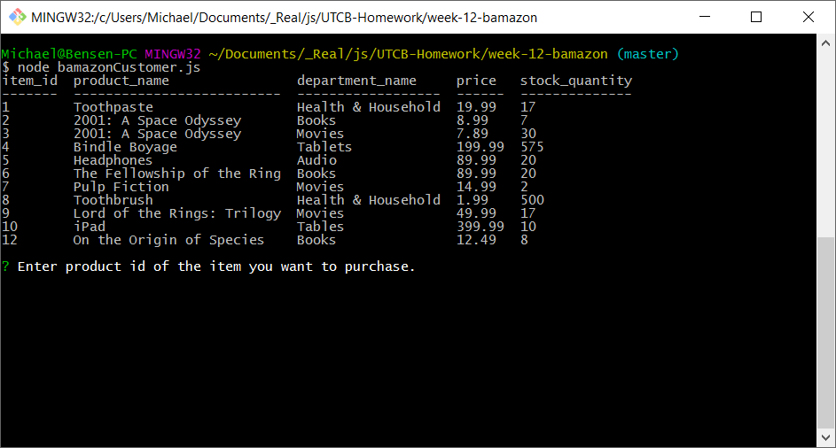
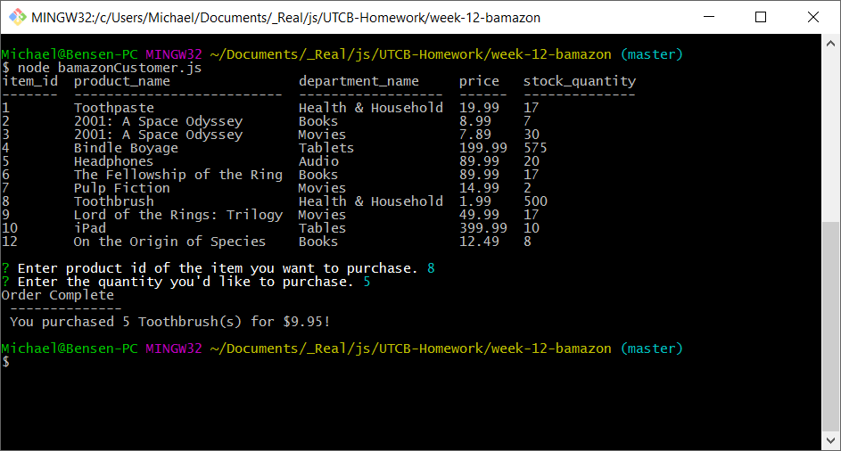
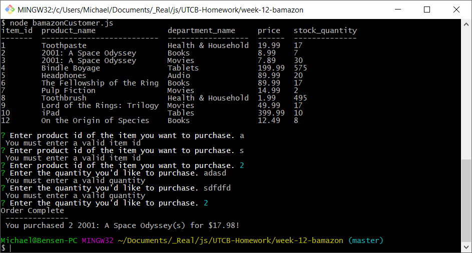
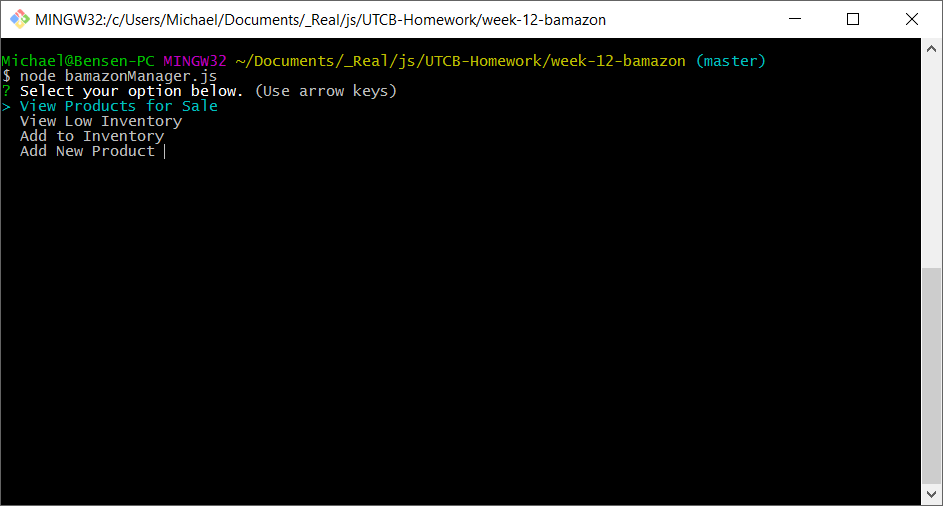
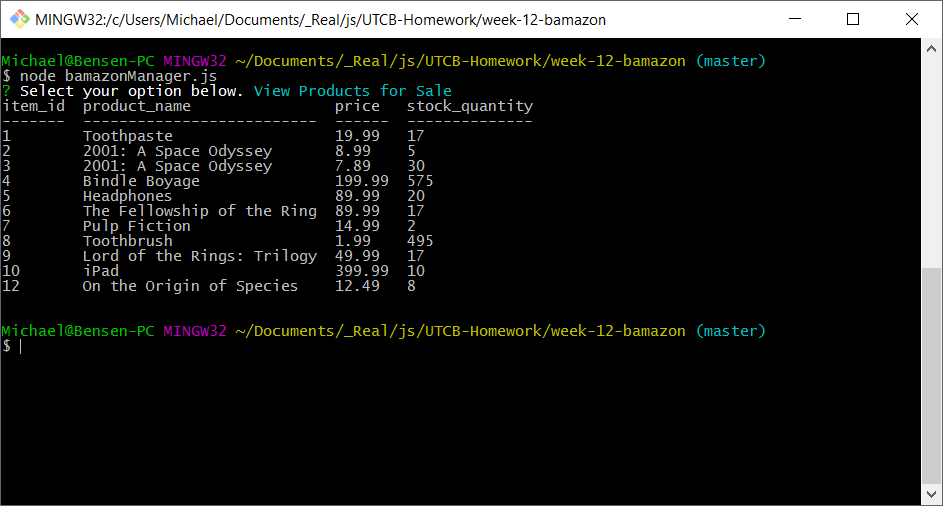
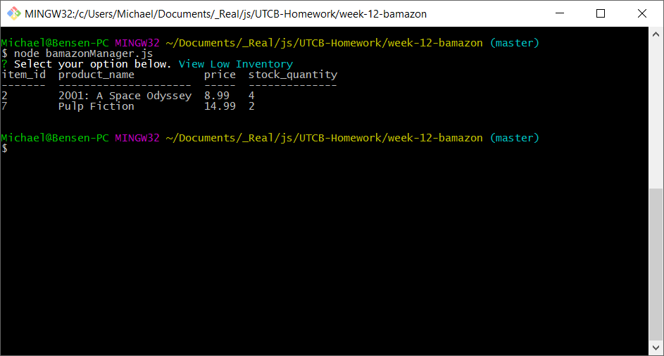
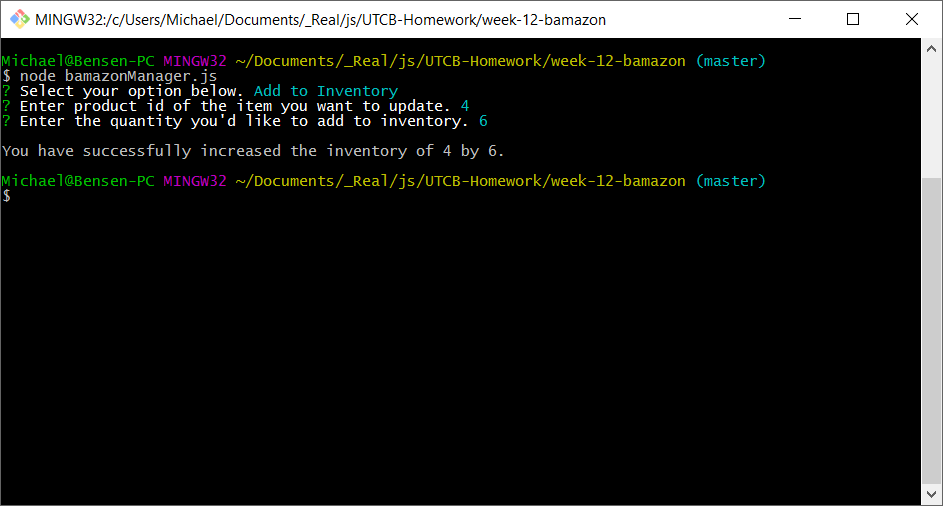
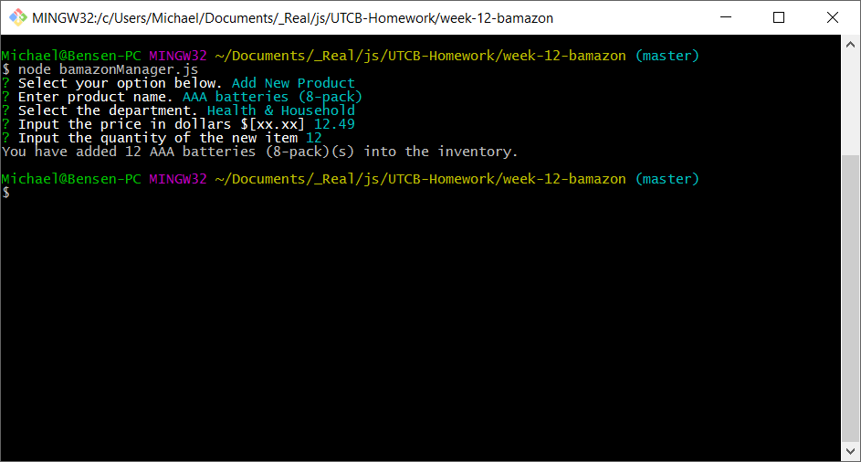
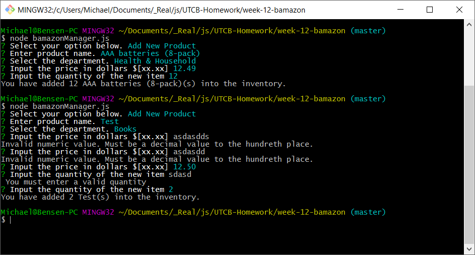

# week-12-bamazon
UTCB Week 12 Bamazon (MySQL + Node.js)

#### Table of Contents
* [Customer View](#customer-view)
  * [All products for sale are returned](#customer-all-products)
  * [Completed Transaction](#customer-completed-transaction)
  * [Example of validation](#customer-example-validation)
* [Manager View](#manager-view)
  * [Manager Menu Choices](#manager-menu-choices)
  * [View Products for sale](#manager-view-products)
  * [View Low Inventory](#manager-view-low-inventory)
  * [Add To Inventory](#manager-add-to-inventory)
  * [Add New Product](#manager-add-new-product)
  * [Example of validation](#manager-example-validation)

## <a name="customer-view">Customer View (entry point bamazonCustomer.js)</a>
### <a name="customer-all-products">All products for sale are returned</a>

### <a name="customer-completed-transaction">Completed Transaction</a>

### <a name="customer-example-validation">Example of validation:</a>

## <a name="manager-view">Manager View (entry point bamazonManager.js)</a>
### <a name="manager-menu-choices">Manager Menu Choices</a>

### <a name="manager-view-products">View Products for sale</a>

### <a name="manager-view-low-inventory">View Low Inventory</a>

### <a name="manager-add-to-inventory">Add To Inventory</a>

### <a name="manager-add-new-product">Add New Product</a>

### <a name="manager-example-validation">Example of validation:</a>

